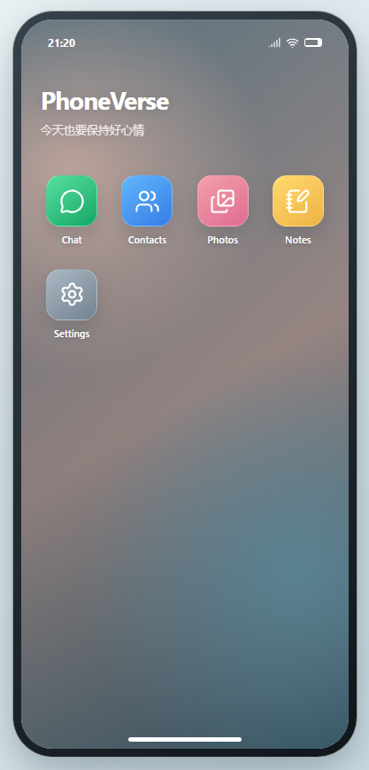
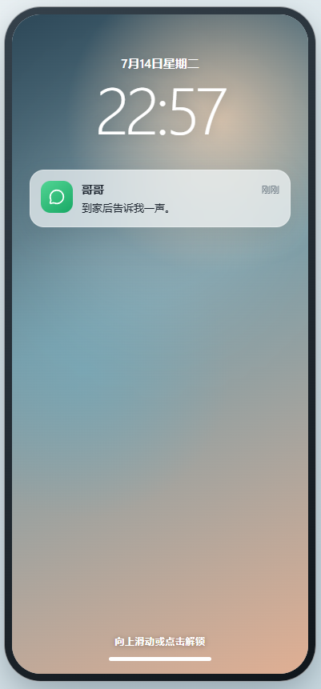
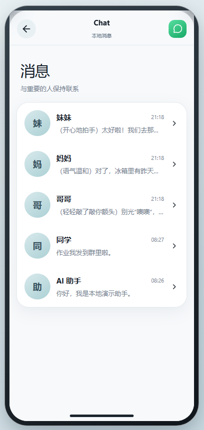
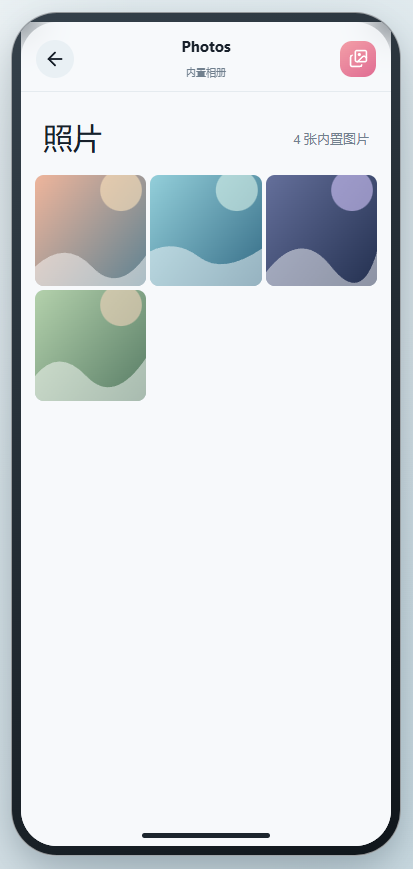
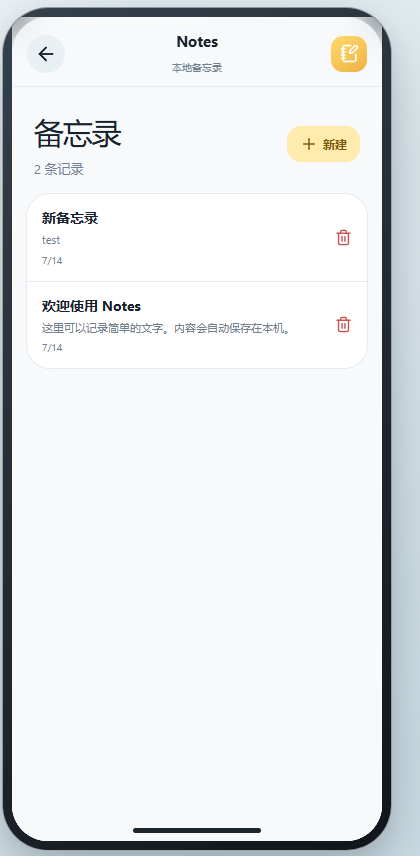
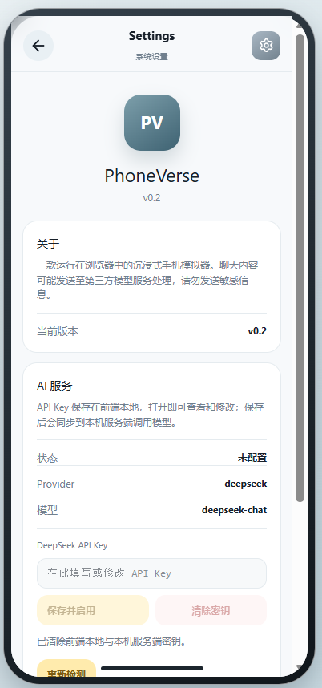

# PhoneVerse

**浏览器里的沉浸式 AI 手机模拟器**  （幸福家庭模拟器？）总之还没弄完，，，
解锁 · 打开应用 · 和角色真正聊起来


[快速开始](#-快速开始) · [功能亮点](#-功能亮点) · [界面一览](#-界面一览) · [技术架构](#-技术架构) · [路线图](#-路线图)



---

## 这是什么？

PhoneVerse 不是又一个聊天框。

它是一部跑在网页里的「手机」：锁屏、通知、桌面、消息、相册、备忘录、设置——完整的一小套操作系统体验。  
当你点开某个联系人，对面回复的不再是死脚本，而是 **经由本机 BFF 调用大模型** 的真实角色对话。

> 打开浏览器 → 解锁手机 → 和「哥哥 / 妈妈 / 妹妹…」聊起来。  
> 像演戏，也像过日子。

---

## ✨ 功能亮点

| | |
|---|---|
| **整机沉浸** | 锁屏通知、上滑解锁、主屏应用矩阵，一眼就是「手机」 |
| **真实 AI 聊天** | DeepSeek 驱动；失败可重试；无本地假回复 |
| **可编辑人设** | 点头像改名字 / 状态 / 人设文案，角色随你定义 |
| **本地优先** | 会话、备忘、相册元数据走 IndexedDB，关掉标签页也不丢 |
| **密钥可控** | API Key 存在你本机；设置页一键保存 / 清除 |
| **一键启动** | Windows 双击 `一键打开.bat` 即可打开 |

---

## 🖼 界面一览

### 锁屏 · 消息 · 对话

| 锁屏与通知 | 消息列表 | 角色对话 |
|:---:|:---:|:---:|
|  |  |  |

### 相册 · 备忘录 · 设置

| 相册 | 备忘录 | AI 设置 |
|:---:|:---:|:---:|
|  |  |  |

---

## 🚀 快速开始

### 环境要求

- Node.js **18+**（建议 20）
- 一台能上外网的电脑（调用 DeepSeek）
- 一份 [DeepSeek API Key](https://platform.deepseek.com/)

### Windows 最省事

1. 克隆仓库并进入目录  
2. 安装依赖：

```bash
npm install
```

3. （可选）复制环境变量模板：

```bash
copy .env.example .env
```

4. 双击项目根目录的 **`一键打开.bat`**  
   会自动拉起前端 + 后端，并打开 [http://127.0.0.1:5173/](http://127.0.0.1:5173/)

5. 进入手机 → **Settings** → 粘贴 API Key → **保存并启用** → 去 Chat 开聊

> 请保持启动后弹出的黑窗口不要关，关掉服务就停了。

### 命令行方式

```bash
npm install
npm run dev:all
```

| 服务 | 地址 |
|------|------|
| 前端 | http://127.0.0.1:5173/ |
| BFF  | http://127.0.0.1:8787 |

常用脚本：

```bash
npm run lint    # ESLint
npm run test    # Vitest
npm run build   # 生产构建
```

---

## 🏗 技术架构

```text
┌──────────────────────────────┐
│  Browser (React + Vite)      │
│  PhoneShell · Apps · Dexie   │
└──────────────┬───────────────┘
               │  /api  (Vite 代理)
┌──────────────▼───────────────┐
│  Local BFF (Fastify)         │
│  会话 · 限流 · 幂等 · Prompt │
└──────────────┬───────────────┘
               │
┌──────────────▼───────────────┐
│  DeepSeek Chat Completions   │
└──────────────────────────────┘
```

| 层级 | 技术 |
|------|------|
| 前端 | React 19 · Vite 8 · Zustand · Framer Motion · Tailwind 4 · Dexie |
| 后端 | Fastify · TypeScript · 匿名会话 · 限流 / 幂等 |
| AI | DeepSeek（OpenAI 兼容）；密钥仅进本机 BFF 内存 |
| 人设 | 前端编辑 → `personas/*.json` 落盘，启动可回同步 |

设计灵感来自现代手机系统，但使用自有视觉与图标，不复刻受保护的系统外观。

---

## 🔐 安全与隐私（请务必读）

- **不要把真实 `AI_API_KEY` 提交到 GitHub**（`.env` 已在 `.gitignore`）
- 聊天内容会发往第三方模型服务，**请勿发送隐私 / 敏感信息**
- 本项目默认本地开发自用；若公网部署，请自行加固鉴权与限流
- 仓库截图与演示数据均为本地体验样例

---

## 🗺 路线图

| 阶段 | 状态 | 内容 |
|------|------|------|
| v0.1 MVP | ✅ | 锁屏 / 桌面 / Chat / Contacts / Photos / Notes / Settings |
| **v0.2 Phase 2** | ✅ 当前 | 真实 AI 聊天 · BFF · 人设编辑 · API Key 管理 |
| Phase 3 | ⏳ | 更多系统应用（电话、天气、音乐…） |
| Phase 4 | ⏳ | 剧情分支与多结局 |
| Phase 5 | ⏳ | 模板商城 · Capacitor 封装 App |

更细的产品说明见 [`docs/product/PhoneVerse_PRD_v0.2.md`](./docs/product/PhoneVerse_PRD_v0.2.md)，完整文档目录见 [`docs/`](./docs/README.md)。

---

## 📁 目录速览

```text
AIchat/
├── README.md            # 项目介绍（本文件）
├── 一键打开.bat          # Windows 一键启动
├── src/                 # 前端：手机壳、应用、存储、API Client
├── server/              # Fastify BFF：会话、聊天、人设同步
├── personas/            # 联系人人设 JSON（编辑后自动写入）
├── docs/                # 产品文档 · 阶段汇报 · 截图
│   ├── product/         # PRD
│   ├── phase2/          # AI 聊天规格与部署
│   ├── reports/         # P0–P2 / Phase2 汇报
│   └── screenshots/     # README 用截图
└── .env.example         # 环境变量模板（无密钥）
```

---

## 🤝 贡献

欢迎 Issue / PR。提交前建议跑一遍：

```bash
npm run lint && npm run test && npm run build
```

---

## 📄 License

个人演示 / 学习项目。代码可自由查看、运行与修改；若正式对外开源，建议自行补充 `LICENSE` 文件。


---

<p align="center">
  <sub>Made for the feeling of unlocking a phone that talks back.</sub><br/>
  <b>PhoneVerse</b> · v0.2
</p>
